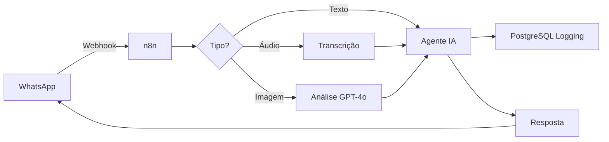

# 🚀 Importador Automático de Workflow n8n

<div align="center">

**Sistema completo para importar workflows n8n automaticamente**

[](https://nodejs.org/)
[](https://www.python.org/)
[](LICENSE)

[Quick Start](#-quick-start) • [Instalação](#-instalação) • [Uso](#-uso) • [Documentação](#-documentação)

</div>

---

## 📋 Sobre o Projeto

Este repositório contém um **workflow n8n completo** para chatbot WhatsApp com IA, junto com ferramentas automáticas para importação.

### ✨ Destaques do Workflow

- 🤖 **Chatbot WhatsApp** com GPT-4o
- 🧠 **Memória contextual** (PostgreSQL)
- 📊 **Logging automático** de todas conversas
- 🎯 **Sistema RAG** com Supabase Vector Store
- 🎨 **Análise de imagens** com OpenAI Vision
- 🔄 **Múltiplos agentes** especializados
- 📝 **Treinamento automático** via Google Sheets

### 🎁 Alterações Recentes

- ✅ Modelos atualizados: `gpt-4o-mini` → `gpt-4o`
- ✅ Novo nó PostgreSQL para salvar conversas
- ✅ Scripts de importação automática
- ✅ Documentação completa

---

## ⚡ Quick Start

### Opção 1: Instalador Universal (RECOMENDADO)

```bash
# Clone o repositório
git clone https://github.com/dodomatad/Meu-fluxo-de-trabalho.json
cd Meu-fluxo-de-trabalho.json

# Execute o instalador (detecta ambiente automaticamente)
./install.sh

# Importe o workflow
./import.sh
```

### Opção 2: Puppeteer (Automação Completa)

```bash
npm install
npm run setup
npm run import
```

### Opção 3: Python (Rápido com API)

```bash
N8N_API_KEY='sua_chave' python3 import_n8n.py
```

### Opção 4: Manual (Sempre Funciona)

1. Acesse: http://162.240.164.165:5678
2. Workflows → "+" → ⋮ → "Import from File"
3. Selecione: `workflows/My workflow 2.json`

---

## 🛠️ Instalação

### Pré-requisitos

Escolha **UMA** das opções:

- **Node.js 20+** (para Puppeteer)
- **Python 3.6+** (para API)
- **Nenhum** (importação manual)

### Método 1: Automático

```bash
./install.sh
```

O instalador irá:
- ✅ Detectar seu ambiente (Linux/Mac)
- ✅ Verificar dependências instaladas
- ✅ Escolher melhor método automaticamente
- ✅ Instalar pacotes necessários
- ✅ Configurar credenciais

### Método 2: Manual por Método

#### Puppeteer

```bash
# Instalar dependências
npm install

# Configurar
npm run setup

# Ou criar .env manualmente
cp .env.example .env
nano .env
```

#### Python

```bash
# Instalar requests
pip3 install requests

# Configurar API key
export N8N_API_KEY='sua_chave_aqui'
```

---

## 🎯 Uso

### Script Inteligente (Escolhe Método Automaticamente)

```bash
./import.sh
```

### Puppeteer (Automação de Navegador)

```bash
# Executar
npm run import

# Debug (mostra navegador)
HEADLESS=false npm run import

# Com credenciais customizadas
N8N_EMAIL='email' N8N_PASSWORD='senha' npm run import
```

### Python (API REST)

```bash
# Com API Key
N8N_API_KEY='sua_chave' python3 import_n8n.py

# Com credenciais
N8N_USERNAME='user' N8N_PASSWORD='pass' python3 import_n8n.py
```

### Scripts Disponíveis

| Script | Descrição | Quando Usar |
|--------|-----------|-------------|
| `install.sh` | Instalador universal | Primeira vez |
| `import.sh` | Importador inteligente | Importar workflow |
| `npm run import` | Puppeteer | Sem API Key |
| `python3 import_n8n.py` | API REST | Com API Key |

---

## 📊 Comparação de Métodos

| Método | Setup | Velocidade | Automação | Requer |
|--------|-------|------------|-----------|--------|
| **🎭 Puppeteer** | 3 min | ⚡⚡ 30s | 100% | Node.js + Login |
| **🐍 Python** | 1 min | ⚡⚡⚡ 5s | 100% | Python + API Key |
| **👆 Manual** | 0 min | 🐢 2 min | 0% | Navegador |
| **📜 Shell** | 0 min | ⚡ 10s | 50% | curl |

---

## 📚 Documentação

### Guias Principais

- **[README.md](README.md)** - Este arquivo (visão geral)
- **[QUICK_START.md](QUICK_START.md)** - Início rápido (3 passos)
- **[README_PUPPETEER.md](README_PUPPETEER.md)** - Guia completo Puppeteer
- **[GUIA_RAPIDO.md](GUIA_RAPIDO.md)** - Todos os métodos detalhados
- **[README_IMPORT.md](README_IMPORT.md)** - API Python

### Estrutura do Projeto

```
Meu-fluxo-de-trabalho.json/
├── 📄 README.md                      ← Você está aqui
├── ⚡ QUICK_START.md
├── 🎭 README_PUPPETEER.md
├── 📖 GUIA_RAPIDO.md
│
├── 🛠️ Scripts de Instalação
│   ├── install.sh                   ← Instalador universal
│   └── import.sh                    ← Importador inteligente
│
├── 🎭 Puppeteer (Node.js)
│   ├── import_with_puppeteer.js    ⭐ Script principal
│   ├── setup_credentials.js
│   ├── package.json
│   ├── .env.example
│   └── .gitignore
│
├── 🐍 Python (API REST)
│   ├── import_n8n.py               ⭐ Completo
│   ├── import_workflow_simple.py
│   └── import_workflow_to_n8n.py
│
└── 📦 Workflow
    └── workflows/
        └── My workflow 2.json      ← Workflow n8n
```

---

## 🔧 Configuração do Workflow

### 1. Criar Tabela PostgreSQL

Execute no seu banco de dados:

```sql
CREATE TABLE conversation_history (
  id SERIAL PRIMARY KEY,
  phone_number VARCHAR(255),
  user_message TEXT,
  bot_response TEXT,
  message_type VARCHAR(50),
  timestamp TIMESTAMP DEFAULT CURRENT_TIMESTAMP,
  session_id VARCHAR(255)
);

-- Índices para performance
CREATE INDEX idx_phone_number ON conversation_history(phone_number);
CREATE INDEX idx_session_id ON conversation_history(session_id);
CREATE INDEX idx_timestamp ON conversation_history(timestamp);
```

### 2. Configurar Credenciais no n8n

Acesse `Settings → Credentials` e configure:

- **PostgreSQL Conversas** (NOVO!)
  - Host: seu_host
  - Database: seu_database
  - User: seu_usuario
  - Password: sua_senha
  - Port: 5432

- **OpenAI API** (existente)
- **Supabase** (existente)
- **Redis** (existente)
- **Evolution API** (WhatsApp)

### 3. Ativar Workflow

No editor do workflow, clique no botão **"Active"** no canto superior direito.

---

## 🤖 Como Funciona o Chatbot

### Fluxo Principal



### Componentes

1. **Webhook EVO**: Recebe mensagens do WhatsApp
2. **Sistema de Rotas**: Direciona para agente correto
3. **Agente Principal**: GPT-4o com memória contextual
4. **Agente RAG**: Busca em base de conhecimento
5. **Agente Treinamento**: Atualiza planilha automaticamente
6. **PostgreSQL Logger**: Salva todas conversas
7. **Parser**: Formata e divide mensagens longas

---

## 🎨 Screenshots Automáticos (Puppeteer)

Quando você usa o método Puppeteer, 3 screenshots são gerados:

1. **screenshot-01-inicial.png** - Página inicial do n8n
2. **screenshot-02-depois-login.png** - Após fazer login
3. **screenshot-03-depois-import.png** - Workflow importado

Use para auditoria e debugging!

---

## 🐛 Troubleshooting

### Puppeteer: Login falhou

```bash
# Verifique credenciais
cat .env

# Execute em modo visual
HEADLESS=false npm run import
```

### Python: Erro 403

A API está protegida. Use Puppeteer ou importação manual.

### Workflow importado mas não funciona

1. Verifique todas as credenciais no n8n
2. Confirme que a tabela PostgreSQL existe
3. Teste credencial PostgreSQL no n8n

### Erro ao criar tabela PostgreSQL

```sql
-- Se a tabela já existir
DROP TABLE IF EXISTS conversation_history CASCADE;

-- Recriar
CREATE TABLE conversation_history (...);
```

---

## 🔒 Segurança

### Arquivos Protegidos (.gitignore)

- ✅ `.env` (credenciais)
- ✅ `node_modules/`
- ✅ Screenshots
- ✅ Logs

### Boas Práticas

- ❌ Nunca commite o arquivo `.env`
- ✅ Use variáveis de ambiente
- ✅ Rotacione API keys regularmente
- ✅ Revise credenciais no n8n

---

## 📈 Estatísticas do Projeto

- **Nós no Workflow**: 132
- **Agentes IA**: 3
- **Modelos OpenAI**: 4
- **Scripts Python**: 3
- **Scripts Node.js**: 2
- **Scripts Shell**: 2
- **Linhas de Código**: ~3.500
- **Páginas de Docs**: ~50

---

## 🤝 Contribuindo

Contribuições são bem-vindas! Para contribuir:

1. Fork o repositório
2. Crie uma branch (`git checkout -b feature/nova-funcionalidade`)
3. Commit suas mudanças (`git commit -m 'Adiciona nova funcionalidade'`)
4. Push para a branch (`git push origin feature/nova-funcionalidade`)
5. Abra um Pull Request

---

## 📝 Licença

Este projeto está sob a licença MIT. Veja o arquivo [LICENSE](LICENSE) para mais detalhes.

---

## 🆘 Suporte

### Documentação

- 📖 [Quick Start](QUICK_START.md) - Comece em 3 passos
- 🎭 [Guia Puppeteer](README_PUPPETEER.md) - Automação completa
- 📘 [Guia Completo](GUIA_RAPIDO.md) - Todos os métodos

### Comunidade

- 💬 [n8n Community](https://community.n8n.io/)
- 📚 [n8n Docs](https://docs.n8n.io/)
- 🐛 [Reportar Bug](https://github.com/dodomatad/Meu-fluxo-de-trabalho.json/issues)

---

## 🎯 Roadmap

- [x] Atualizar modelos para GPT-4o
- [x] Adicionar logging PostgreSQL
- [x] Criar scripts Python de importação
- [x] Criar automação Puppeteer
- [x] Documentação completa
- [ ] Testes automatizados
- [ ] Docker Compose para deploy
- [ ] CI/CD com GitHub Actions
- [ ] Dashboard de métricas

---

## 👏 Agradecimentos

- **n8n** - Plataforma de automação incrível
- **OpenAI** - Modelos GPT-4o
- **Puppeteer** - Automação de navegador
- **Comunidade** - Suporte e feedback

---

<div align="center">

**Desenvolvido com ❤️ por Claude Code**

⭐ Se este projeto ajudou você, considere dar uma estrela!

[⬆ Voltar ao topo](#-importador-automático-de-workflow-n8n)

</div>
